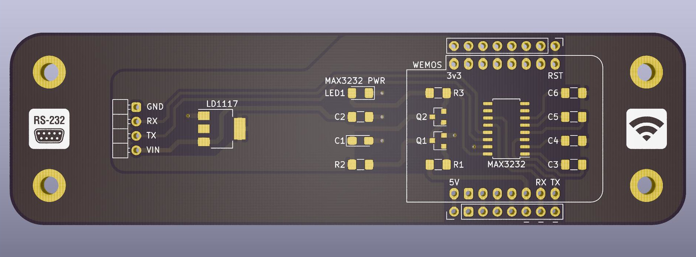
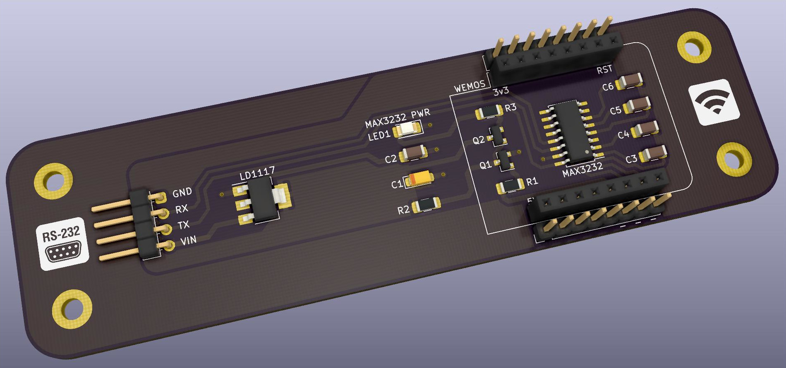
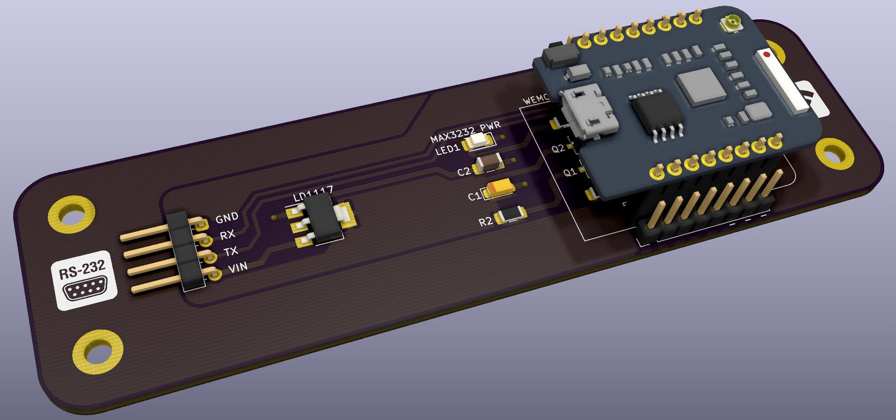
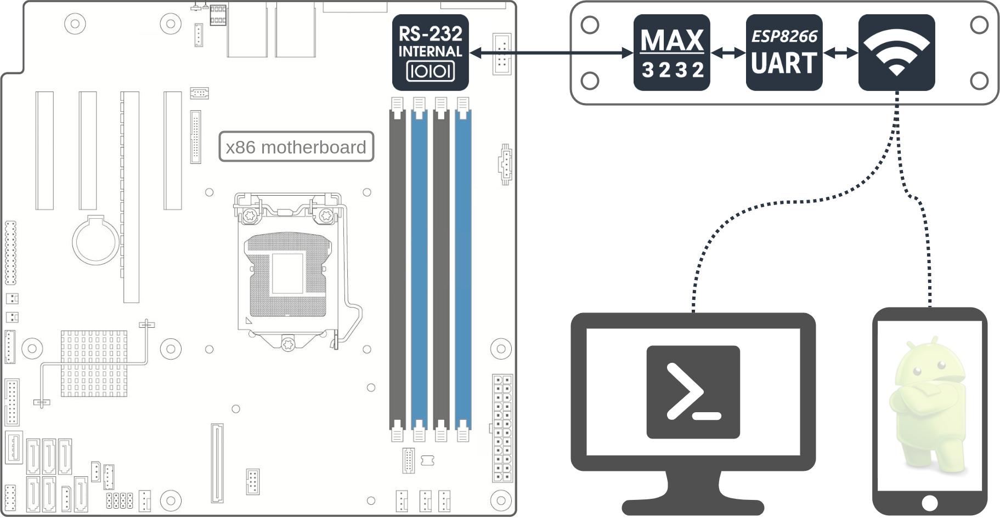

# termint-wifi
This board allows the user to establish wireless terminal connection by reaching an internal RS-232 header over WiFi, using ESP8266 &amp; MAX3232.

## Description
Low-level console access to manage your x86 server can be very useful, and several motherboards offer internal and external RS-232 ports for this purpose. While these are very simple and reliable, we do not want to play around with serial cables and their adapters all the time, to attach our client devices. This is where termint-wifi comes in, making one of your internal serial ports WiFi-ready, granting a convenient way to accomplish server management. It can provide a solid backup path if mounted and wired up in the machine's chassis.

## Features
* Keeps the attached machine easily reachable even if it's network ports are down or misconfigured
* OS independent, and if your chipset supports it, you can manage your UEFI/BIOS over WiFi
* Client independent, you can use any WiFi capable device (e.g. smartphones, laptops, etc.)
* Code independent and upgradeable, you can upload any serial-to-wifi bridge solution, even your own
* Components are very cheap, and you have a few options to select the ESP8266 microcontroller
* Can be powered from microUSB or internal 12V source (recommended free fan header)
* Easily accessible pin headers for potential new features
* Made with THT and mostly superior SMD components, to allow soldering by hand with average tools
* Can link to non-x86 RS-232 capable devices as well

## Technical details

Microcontrollers are very smart nowadays, but RS-232 ports are still a bit difficult to handle, mostly due to voltage level. Because of this, the board uses MAX3232 line driver/receiver to make the connection, and the applied ESP8266 forwards the data from UART to WiFi interface. You can find the full schematic in the [KiCAD project.](kicad_board/)

| Termint-wifi 4-pin header | Motherboard pins |
| ---------- | ---- |
| RX | Internal RS-232 header TXD |
| TX | Internal RS-232 header RXD | 
| GND | Internal RS-232 header GND | 
| VIN | Optional, any 12V pin (recommended free fan header) | 

| Applicable code | Tested |
| ---------- | ---- |
| [ESPTerm](https://espterm.github.io/term.html) | Tested |
| [esp-link](https://github.com/jeelabs/esp-link) | Tested | 
| [ESPEasy](https://github.com/letscontrolit/ESPEasy) | Tested | 

*Keep in mind you can only turn on MAX3232 from code, by setting GPIO5 HIGH. This prevents boot problems caused by pulling Wemos TX low too early.*

| Compatible ESP8266 boards | Tested |
| ---------- | ---- |
| Wemos D1 mini Pro V1.x (wemos, blue) | Tested |
| Wemos D1 mini Pro V2.x (lolin, green) | Not tested | 
| Wemos D1 mini | Not tested | 
| Wemos D1 mini Lite | Not tested | 

*Models with external antenna are recommended, if the board is mounted inside chassis.*

## PCB BOM
The following components are needed to assemble the pcb:

| Component  | Type | Package | Value | Quantity |
| ---------- | ---- | ------- | ----- | -------- |
| R1 | Resistor | SMD-1206 | 100kΩ | 1 |
| R2 | Resistor | SMD-1206 | 10kΩ | 1 |
| R3 | Resistor | SMD-1206 | 130Ω | 1 |
| C1 | Tantalum capacitor | SMD-1206 | 10uF | 1 |
| C2-C6 | Capacitor | SMD-1206 | 100nF | 5 |
| Q1 | BJT Transistor | SOT-23 | MMBT3904 | 1 |
| Q2 | FET Transistor | SOT-23 | AO3401 | 1 |
| LED1 | LED | SMD-1206 | Vf=2V | 1 |
| LD1117 | Voltage regulator | SOT223 | LD1117S33TR | 1 |
| MAX3232 | RS232 Driver | SOIC16 | MAX3232IDR/IDRG4 | 1 |
| Pin socket | Connector | 2.54mm single row | 8-pin female | 2 |
| Pin header | Connector | 2.54mm single row | 8-pin male | 2 |
| Pin header, angled | Connector | 2.54mm single row | 4-pin male | 1 |

Additional parts:

| Component  | Type | Package | Quantity |
| ---------- | ---- | ------- | -------- |
| *Wemos D1 mini* | *ESP8266 board* | *Lite/Pro/Pro_V2* | *1* | 

## Assembly and application
1. Clone or download this repository.
2. Use the prebuilt [gerber archive](kicad_board/gerber/termint_wifi.zip) to print the pcb. Any chinese manufacturer (JLPCB, ALLPCB, PCBWAY, etc.) can fabricate a copy for a couple dollars. Really, it's dirt cheap.
3. Once you got the pcb and the few listed components, assemble termint-wifi by hand soldering, no special tool needed.
4. Upload the desired code (from the list or your own) to the selected Wemos using [esptool](https://github.com/espressif/esptool) or other similar software, and put it in the socket.
5. Mount the board in the target machine's chassis, wire up the listed connections, apply power.
6. Based on the code you use, connect over WiFi and test the access to your RS-232 port.

*The uploaded board fits perfectly on the side of an Antec ISK600M chassis. Resize the pcb in KiCAD as needed.*
